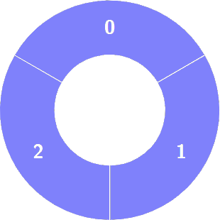
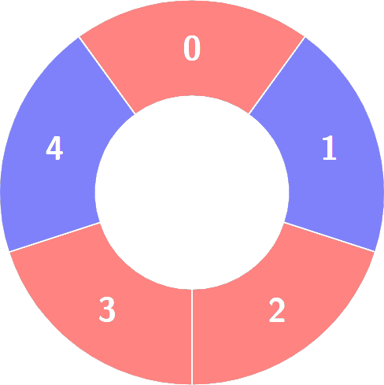
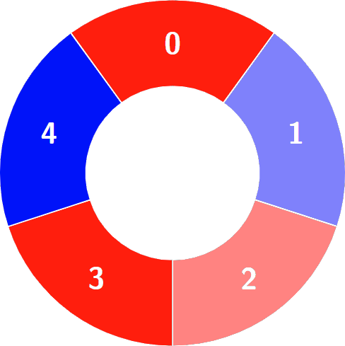
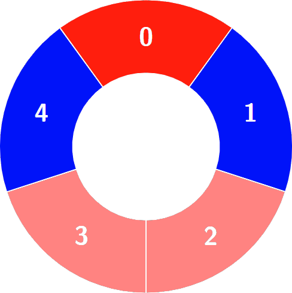
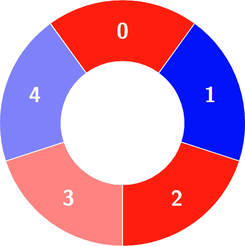

# Leetcode Biweekly Contest 134
## Problem 100336. Alternating Groups I
### Problem Statement
There is a circle of red and blue tiles. You are given an array of integers colors . The color of tile i is represented by
colors[i] :
- colors[i] == 0 means that tile i is red.
- colors[i] == 1 means that tile i is blue.

Every 3 contiguous tiles in the circle with alternating colors (the middle tile has a different color from its left and right tiles)
is called an alternating group.

Return the number of alternating groups.

Note that since colors represents a circle, the first and the last tiles are considered to be next to each other.

### Example 1:

**Input:**
```shell
colors = [1,1,1]
```
**Output:**
```shell
0
```
**Explanation:**



### Example 2:
**Input:** 
```shell
colors = [0,1,0,0,1]
```
**Output:** 
```shell
3
```
**Explanation:**



Alternating Groups:

    


### Python Solution
```python
class Solution:
    def numberOfAlternatingGroups(self, colors: List[int]) -> int:
        alt_grp = 0
        for i in range(1, len(colors)-1):
            if colors[i] != colors[i-1] and colors[i] != colors[i+1]:
                alt_grp += 1
        if colors[0] != colors[1] and colors[0] != colors[-1]:
            alt_grp += 1
        if colors[-1] != colors[0] and colors[-1] != colors[-2]:
            alt_grp += 1
            
        return alt_grp
```
